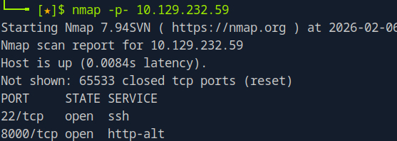
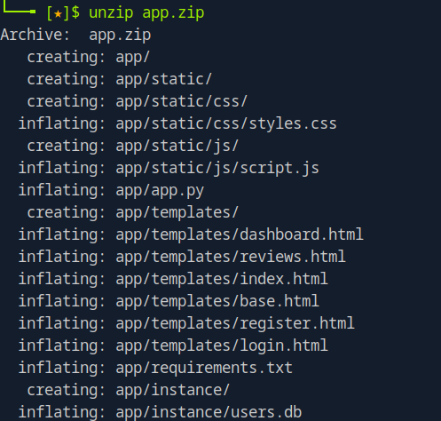
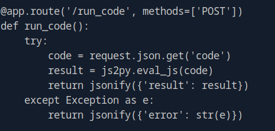
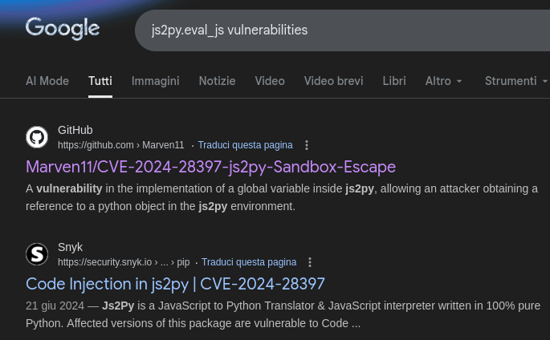
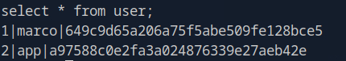

******CodePartTwo******

CodePartTwo is an HTB Linux machine classified as Easy.

*******1 Service Enumeration*******

I always feel safer if i can do an overall port scan. So if the process is fast enough i try it:

The result shows that for tcp, only ports 22 and 8000 are open.

I tried to fingerprint the services.

This didn't give too much information, so at this point i visited the web service with the browser.

*******2 Searching the Foothold*******

On the web page we have the option to register, login or download the app source code.

I downloaded the code, then i proceeded with registration and login.

Once signed in we are given the possibility to run code. At this point to have a better grasp of the attack angle i went to look at the app source code.

These are the principal components we can find:

Looking at app.py, this is the flask route which lets us run the code:

We can see that the code we submit in the browser is posted on this route on the backend, then is run with the js2py.eval_js function.
This function is used to execute Javascript code in a python context (such as app.py) and return the last expression.
Is used, among other things, in web scraping.
Since this library can only execute JS code, i didn't see an attack angle unless it had vulnerable versions.
So i searched for a vulnerability:

CVE-2024-28397 allow an attacker to brake the JS sandbox and run commands in the python environment. So we may be able to execute code if we are in the right circumnstances.
The vulnerability requirements are:

and looking at the application requirements.txt:

The library version is vulnerable, also the app is running flask 3.0.3 which supports python3, so with the right payload we should have RCE.

Using the specific PoC for this vulnerability, adjusted with some trial and error you should be able to get RCE as the "app" user.

*******3 Lateral Movement*******

The only two users having a home directory are "app" and "marco".
Having the shell as "app", the first thing i did was "sudo -l", but the user wasn't able to run sudo.
The second thing i did was to look at the app database.
We know that we have a db file at app/instance/users.db.
So connecting to the database with sqlite3 and enumerating the tables we find:

These are md5 hashes (which can be confirmed also looking at the app source code). Trying to crack with John, we retrieve the marco credentials:

*******4 Privilege Escalation*******

With the marco user and its cute password we can access through ssh, and we can run "sudo -l":

This time marco can run the command **/usr/local/bin/npbackup-cli** with sudo. I didn't know this executable so i searched some info. It is an executable for managing backups. With **npbackup-cli --help**, we can see that the **raw** option allow us to run commands "against the backend".

So i tried:

The error suggests that this binary is using the **restic** command.
So i looked it up on GTFObins:

I tried the suggested payload:

The error suggests that this process cannot spawn a terminal process, indeed we can see that the payload is trying to open an sh shell.
If we replace the payload with something which runs on the background it could work. At first i tried with netcat, but the nc on the target doesn't provide the "-e" option to spawn /bin/bash, so you would have to transfer nc from your attack machine (or use another payload).
With this final payload i got the root shell on my listener:

I hope you enjoyed, Bye.
