******Data******

Data is an HTB Linux machine classified as Easy.

*******1 Service Enumeration*******

Doing a full tcp port scan we can see that the machine has only two open ports 22 and 3000:

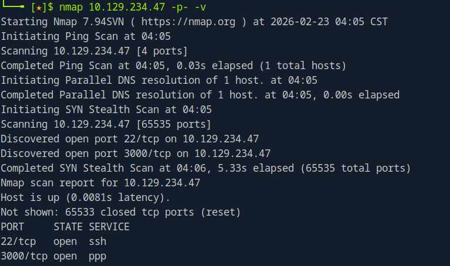

While 22 is hosting the ssh service, we can see that on port 3000 is running Grafana.

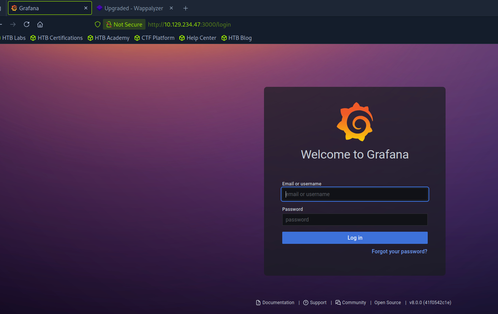

*******2 Foothold*******

This version of Grafana has a path traversal vulnerability which results in Local File Inclusion, allowing us to access files in the target operating system which can be accessed by the user running the Grafana Service.

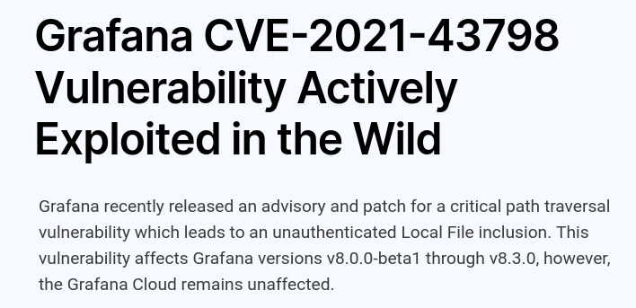

I have used an exploit to download the database file:

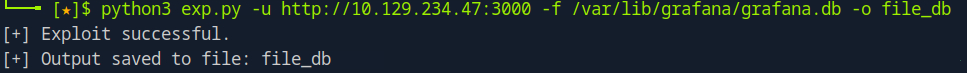

But the same result can be obtained making the following request with curl:

**curl htttp://10.129.234.47:3000/public/plugins/stat/../../../../../../../../../../../../../../../../var/lib/grafana/grafana.db --path-as-is -o file_db**

Checking the type of the .db file we can see that is a Sqlite3 file:

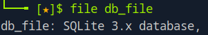

We can interact with the database and query the users:

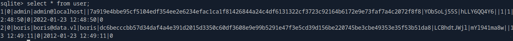

We can save the hashes and try to crack them to get the passwords. Examining them with hashid we find that the format cannot be recognized, searching online i found a tool that can transform the grafana hashes in a format recognized by hashcat.

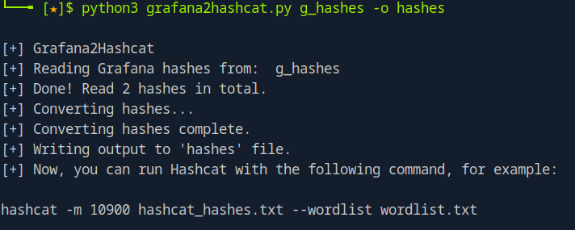

Now we can use hashcat to try to retrieve a password:

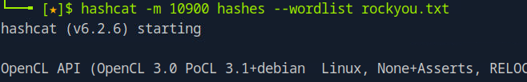

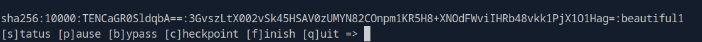

We retrieved the password "beutiful1". Using it with the user boris we can access with ssh:

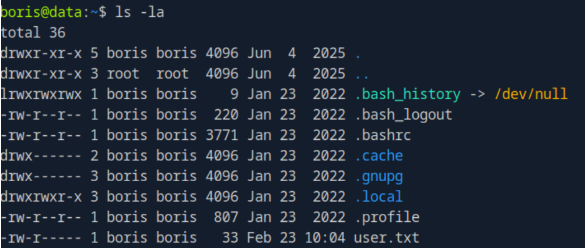

So now we got a shell. One thing we can notice is that if we try to read /etc/passwd wit the local file inclusion vulnerability we don't see the boris user:

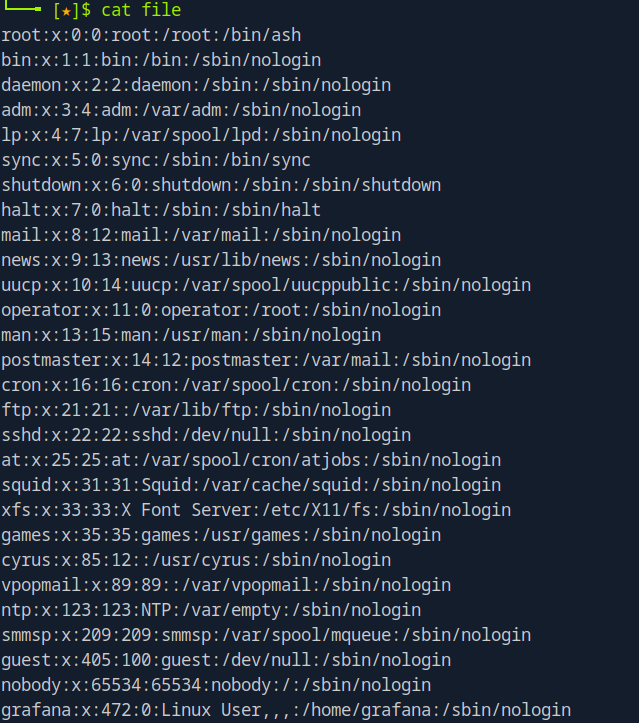

and the content differs from the /etc/passwd file we can read in the boris shell. This means that the Grafana application is likely running in a container.

*******3 Privilege Escalation*******

The user can run the following command as sudo:

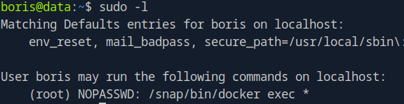

This command allow a user to "Run a command in a running container":

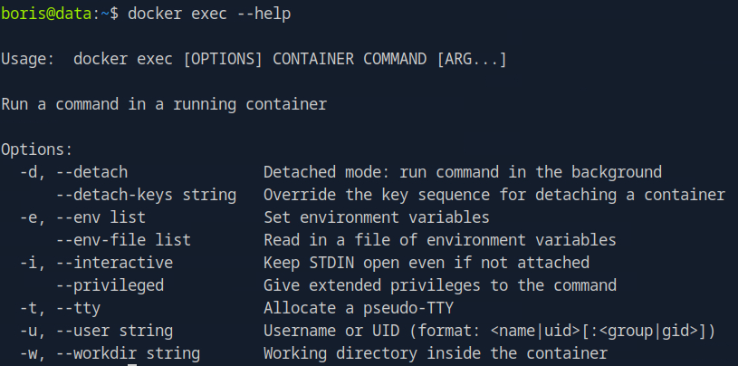

However it requires the container id which we want to run a command in. Our user doesn't have access to the locations where the containers usually live, but watching for running processes we can retrieve the container id:

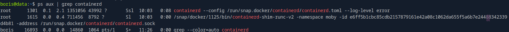

Now we can run the command. Because of the wildcard we can add whatever argument we want to the command, so we try to spwan a shell inside the container as the root user:

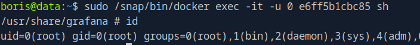

We have root privileges inside the container, so we only have to escape the container environment to acquire root privileges on the host. If we anumerate the capabilities we find:

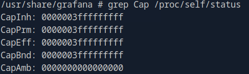

We are interested in the field CapEff, Effective Capabilities, the set that determines whether a privileged operation succeeds.
This field is computed based on other Cap fields and the kernel checks it (at syscall time) to know if a privileged process can be executed. Let's decode them:

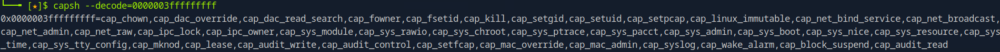

We can see that the set of effective capabilities comprises CAP_SYS_ADMIN a capability that allow us to mount he file system and manipulate namespaces. 
So we see that we can mount /dev/sda1, the host root partition, to a new directory inside the container and move there.

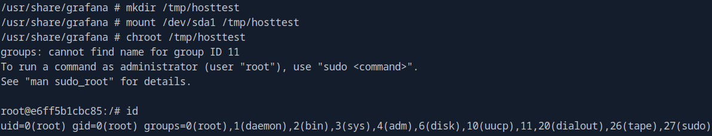

The mount operation is succesfull and now we can access the host filesystem from inside the container where we have full root privileges. From here we can manipulate every file of the host and gain real root privileges.

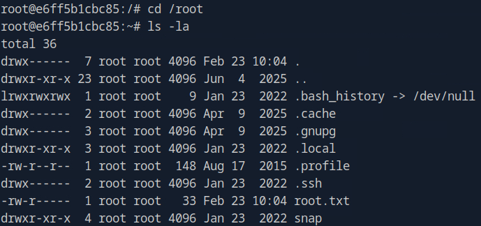

