******Reset******

Reset is an HTB Linux machine classified as Easy.

*******1 Service Enumeration*******

As always, approaching this machine i did a full TCP scan.

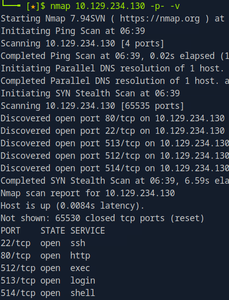

The scan result shows, beside ssh and http, three interesting services: rsh, rlogin and rexec. I tried for a while to check misconfigurations on those, but i couldn't find anything. 
Then i moved to the http web server.

*******2 Foothold*******

Navigating to the target we can see an admin login portal:

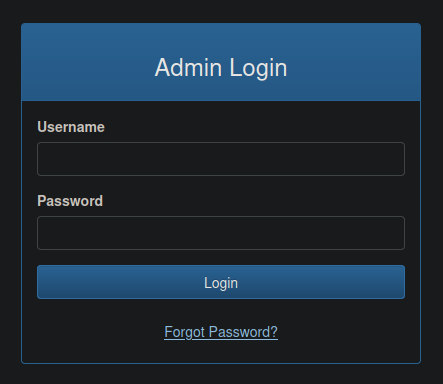

Trying the some users with the change password functionality, we can find the user *admin*.

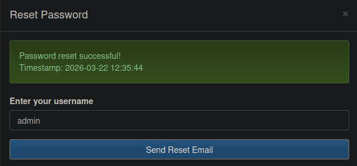

While when trying a not registered user, we get an error message:

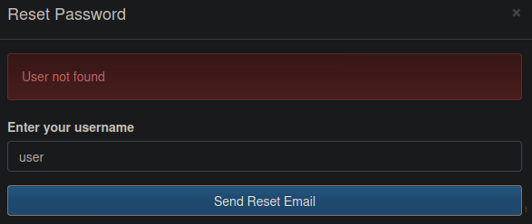

Examining the response we can see that the new password value is sent in the response body:

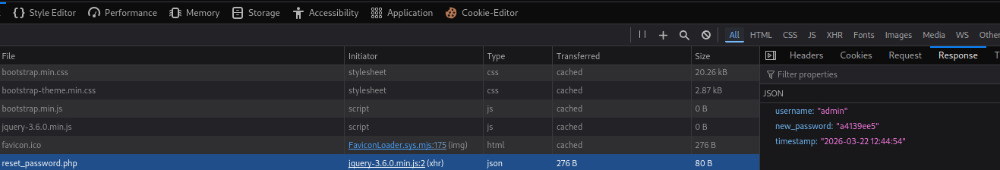

So now we have the credentials to access the web appplication. From within we can see that we are provided with the functionality to view logs:

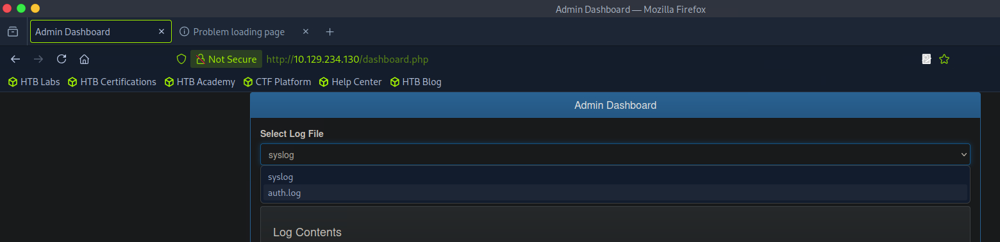

Even though only two options are given from the frontend we can always try to include different files, crafting our requests. 
I tried to include /etc/passwd but it doesn't work.
So noticing that the webserver is running apache We can try to include apache logs:

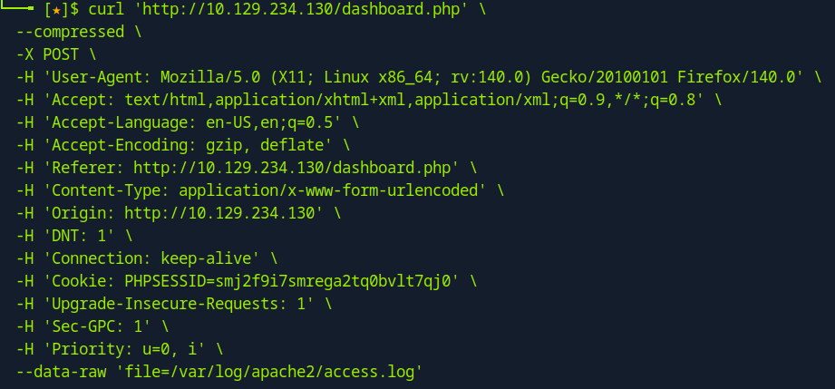

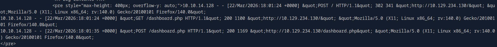

We see that we could successfully include apache logs. So now we should try *Log Poisoning*.
First we send a request with the payload in the user agent:

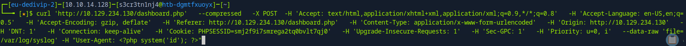

Then we make a request to the access.log again:

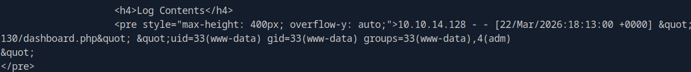

Form the response we see that the *id* command is correctly executed.
So we can use the following request to get a reverse shell:

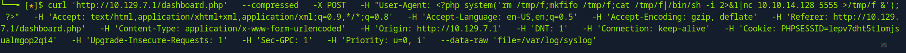

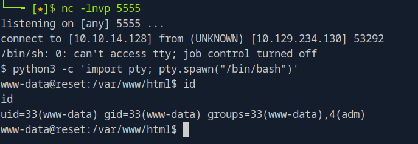

*******3 Privilege Escalation*******

The *www-data* user is also a member of the adm group, this group can read logs (as we could infer from what we have done so far).
In the system are present 2 users: *local* and *sadm*.
Since from my internal enumeration i found that *sadm* was allowed to run rsh commands (from the content of /etc/hosts.equiv), i went to the */var/log* folder and searched for the string *sadm* in all the files:
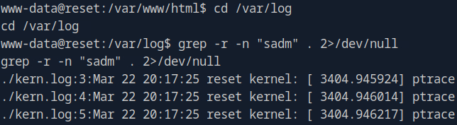

This will output all the content which includes *sadm* from all the files.
The file audit.log, depending on the configuration can contain different events, in this case recorded system calls with also commands. Some of the commands where encoded in hex format.
Decoding one of these commands i could retrieve the password of the *sadm* user:

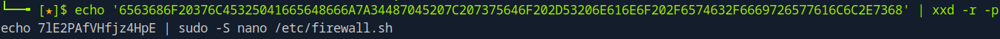

and i could get a shell as this user:

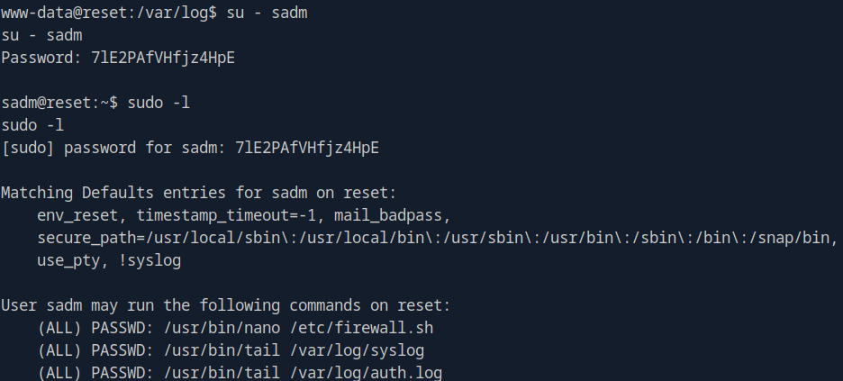

From the output above we can see that the *sadm* user can use *sudo* the command *nano /etc/firewall.sh*.
This offers a privilege escaltion path since we can spawn a shell through *nano*, as aligned here:

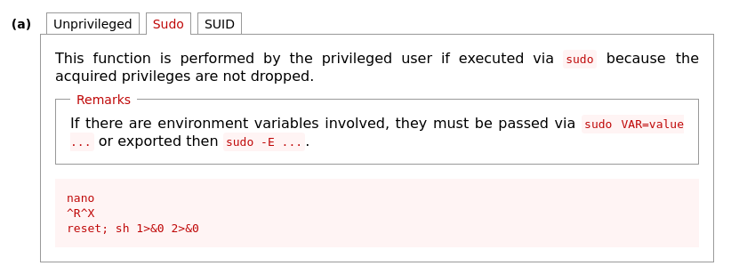

Following the procedure we get a shell as root:

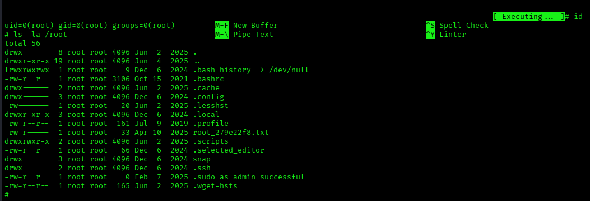
