******Timelapse******

Timelapse is an HTB Windows machine classified as Easy.

*******1 Service Enumeration*******

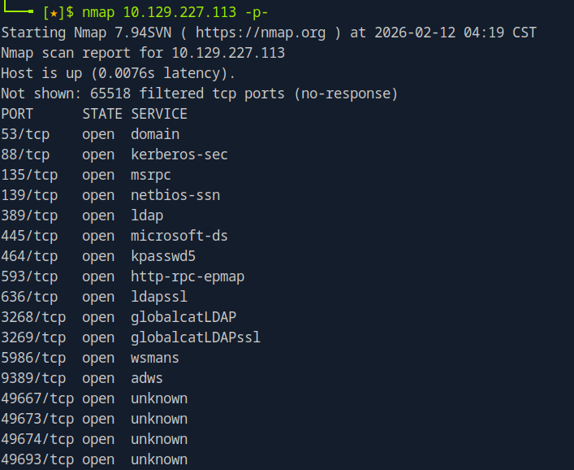

The result shows several TCP ports open. We can recognize this machine is a domain controller for the presence of the kerberos service on port 88.
Also there are interesting services which we can interact with like SMB (445), RPC (135), ldap (389, 636) and possibly winrm over https (5986).
I tried to get more information with the service scan + default scripts scan.

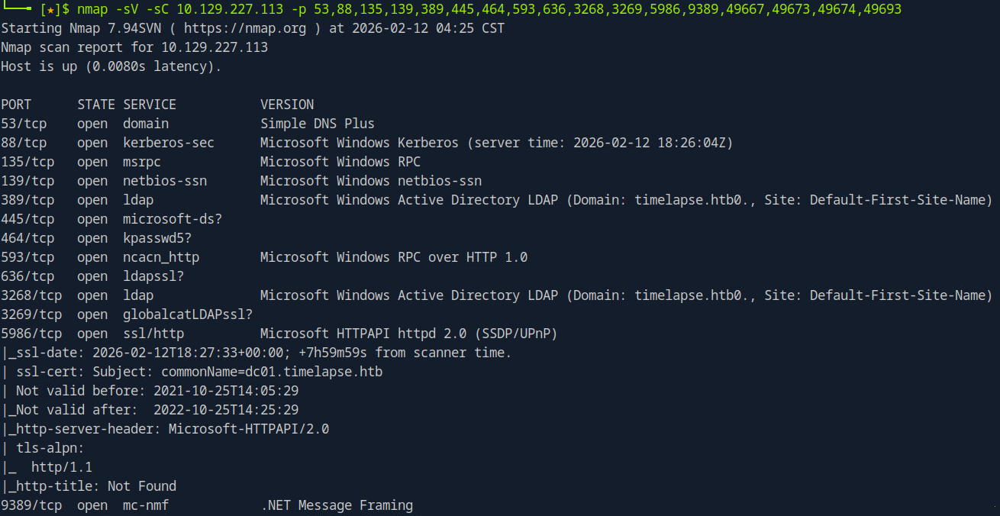

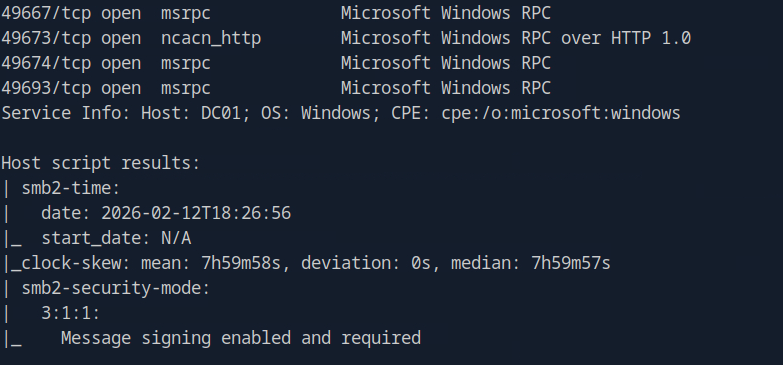

From this scan we have obtained the name of domain name *timelaps.htb* and the FQDN of the machine *dc01.timelaps.htb*. We can add them to /etc/hosts linked to the machine IP.
Also we can confirm that the service port 5986 is winrm over HTTPS (Microsoft HTTPAPI).

*******2 Foothold*******

Since SMB is the easier service to interact i started with that one.

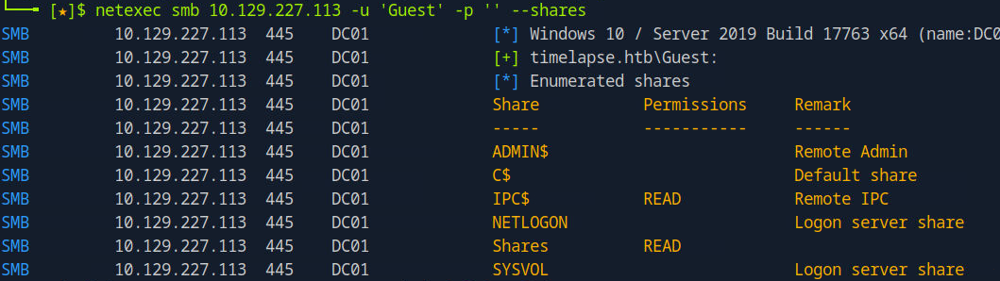

The Guest user has read access over the *Shares* share. So i downloaded everything:

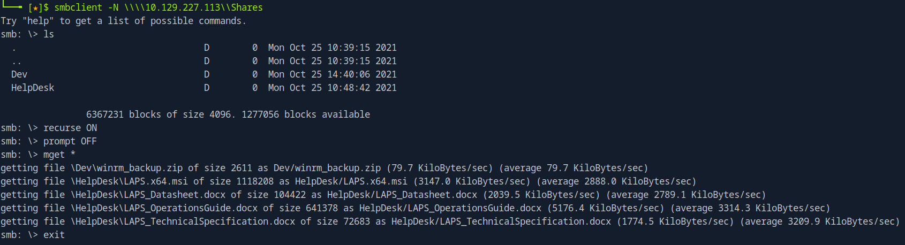

In the Dev share there is a zip file colled *winrm_backup.zip*. The name suggests that has something to so with winrm, so i tried to extract it:

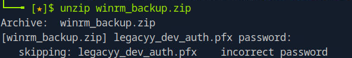

It's password protected, we have to extract the hash, crack it and then use the resulting password to extract the zip file:

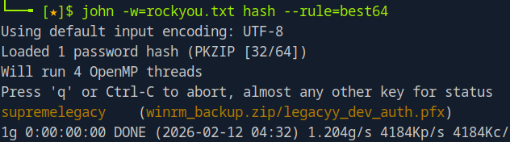

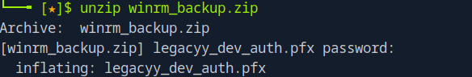

The zip contained a .pfx file.

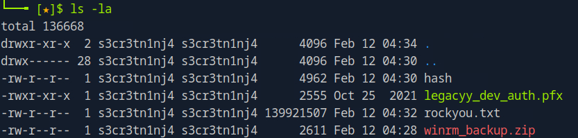

A .pfx file is a password-protected, binary file used in windows to securely store a SSL/TLS certificate, its corresponding private key, and optionally other intermediate certificates.
The winrm protocol on windows supports client authentication through SSL/TLS certificates, if the certificate is mapped to a valid user with Remote Management access and client authentication is enabled. This is another authentication mechanism valid for winrm other than Basic auth (username+password), NTLM and Kerberos. At this point we don't know yet that this is the case, first we need to inspect the content of the .pfx file, but it's a good guess (given also the name of the zip file). trying to inspect the .pfx file we see that it's password protected, so we do the same procedure as above:

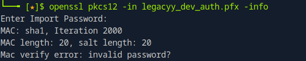

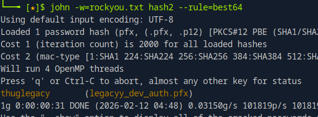

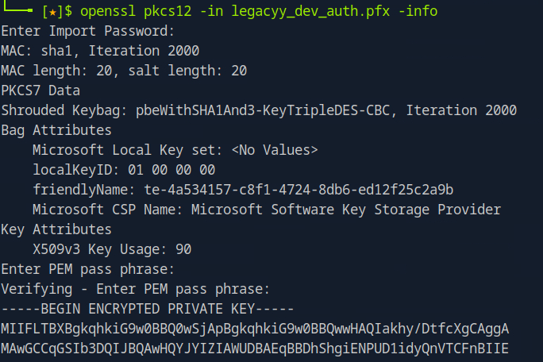

Inspecting the content of the file we see that it contains both the certificate and the private key.
To use them with evil-wirm on linux we need to have one (PEM) file for each:

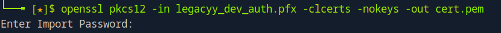

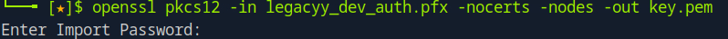

Now let's inspect the content of the certificate:

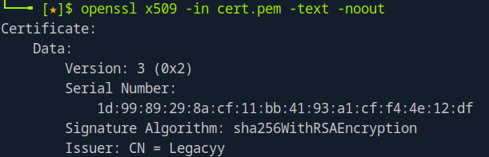

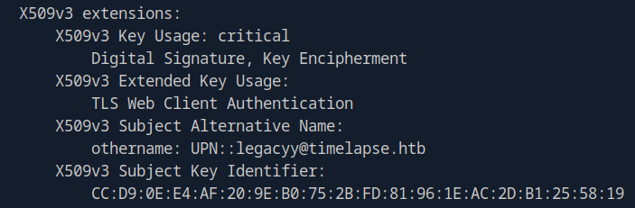

From this we can see that has been issued by *legacyy@timelapse.htb* (Active Directory uses that UPN to map the certificate to a user account) and that is a *TLS Web Client Authentication* certificate.

Now we can use the new files to try to access with evil-winrm:

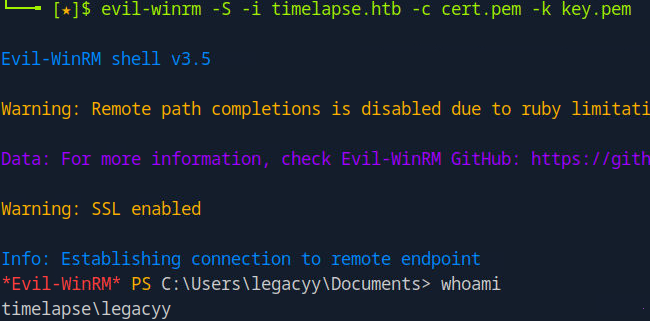

*******3 Post-Exploitation and Privilege Escalation*******

We are logged in with the *legacyy* user. The first thing i did was try to see which privileges he had:

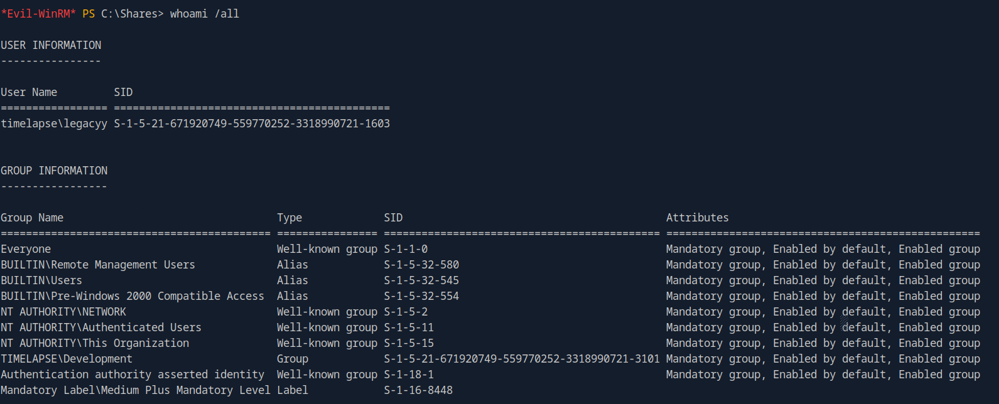

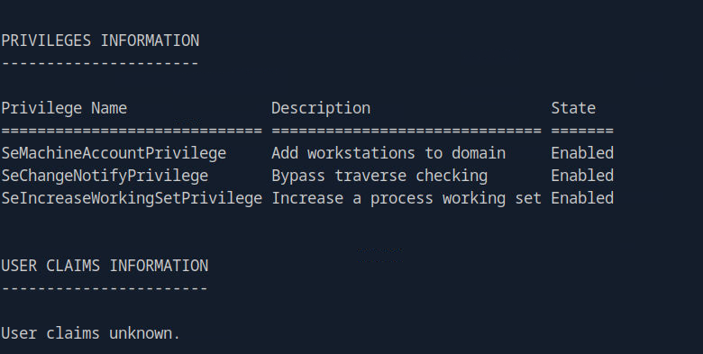

Beside being part of the *Remote Management Users* group, the privileges and groups are the ones assigned usually to normal users.
Going ahead with internal enumeration we can see that this user doesn't have many permissions and access to few resources.

However i remembered that we we had the *Helpdesk* folder in the share which we didn't use yet (to access we used only the content of the *Dev* folder).
*Helpdesk* contains Microsoft documentation about LAPS (Local Administrator Password Solution) and the installer file. LAPS is a Microsoft solution that automatically manages and rotates the local Administrator password on domain-joined machines. The password of the local administrator is written as a plaintext attribute on the computer object *ms-Mcs-AdmPwd*. Inspecting the documentation we can read that a component called CSE is installed by default when running the installer and the main binary will be located at: *C:\Program Files\LAPS\CSE\AdmPwd.dll*. We can see that this binary is present on the machine so LAPS should be installed. We can try to read the *ms-Mcs-AdmPwd* property with this command:

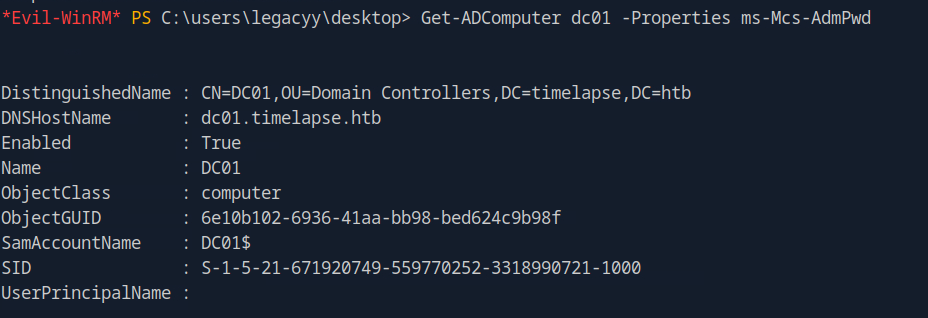

But we see that it's not returned. Likely our user doesn't have the permission.
We can use LAPSToolkit.ps1 to enumerate who has permission to manage LAPS (you first need to upload it on the machine). The command *Find-AdmPwdExtendedRights* retrieves who has permission to read the LAPS password attribute.

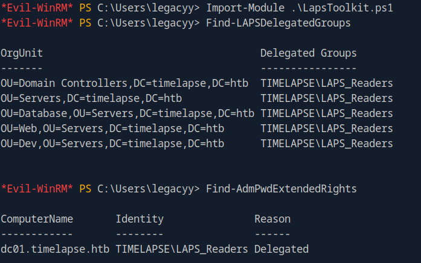

From this we can see that on *dc01.timelapse.htb* the group *LAPS_Readers* has extended rights which implies it can also read the *ms-Mcs-AdmPwd* property. Now we want to see who is contained in this group:

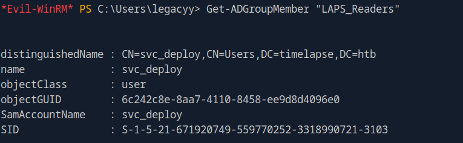

We see that the *svc_deploy* user is member of the group, so if we can access with this user we should be able to read the admin password.
I used this command to search the filesystem for a the *svc_deploy* string:

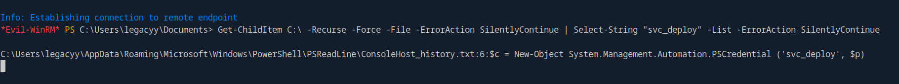

We can see that the Powershell history file contains the credentials for *the svc_deploy* user:

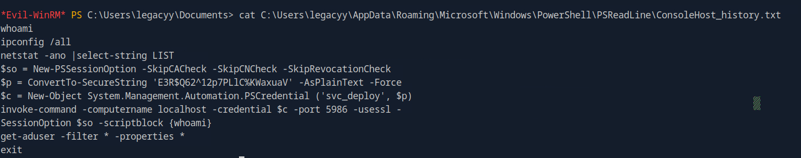

Now we can access with *svc_deploy* and read the *Administrator* password:

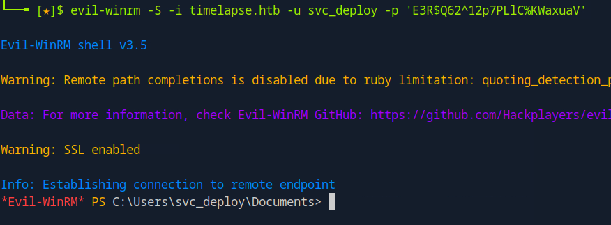

Then we can access as Administrator.

