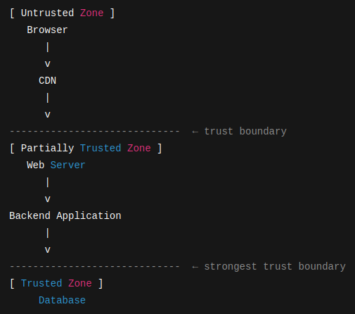
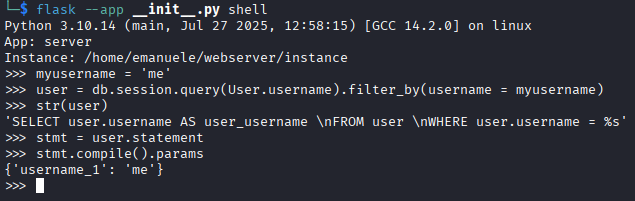
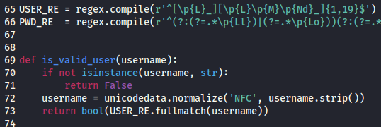
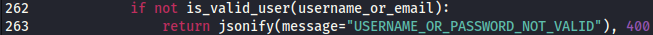

# WebApp Security Assessment

During the development and deployment of a web application i considered a great learning opportunity to address its security on my own.
In the following there are some consideration and steps that i took in order to provide myself the security level i was striving for.

****************************1 Architecture****************************

The Web Application we are talking about is essentially a blog/social network.

The Application Architecture is constitued by:
- A Database: the database is where all the data is stored. The secure set up for this service is to not be exposed on external IP interfaces, have strong authentication mechanism (good user/password combination, default users disabled), and possiblly follow the principle of least privilege (for which db users should be able to perform only actions strictly required to them).  
- A Backend API Layer: This is the level which communicates with both the db and the frontend interface and where resides the application logic. This service like the DB one, should run on internal IP interfaces only (loopback address), otherwise it would be exposed on the internet and attackers would be able to bypass the webserver logic to directly make Requests to the API endpoints. 
- A Frontend Application Layer: This is the layer where the user interacts with the application. It communicates with the frontend through REST API. Security wise request coming from the frontend level should be treated as potentially malicious.
- A Webserver: This service has the role to serve applications resources. In our case it would serve the frontend static applications files (when requested through the browser). It is also this service which routes the requests made by the frontend to the correct API endpoints, acting as a reverse proxy. This service is also capable to enhance security, enforcing the https protocol for all the requests and through the set up of specific HTTP headers.
- A CDN (Content Delivery Network): The role of a CDN is to speed up the connection through specific configurations and to efficiently cache content. This caching capability is very useful as it avoids to be requested for all the content the CDN has cached, thus diminishing the amount of requests being made to our origin. It can also enhance security through the use of a WAF (Web Application Firewall). Lastly we have to specify that the CDN routes all the requests made to our domain to the webserver, thus acting as a first reverse proxy.

So in this case the request flow is:

****************************1 CDN****************************

We will not go through the secure configuration of the CDN, because is CDN specific and it has to be done on the CDN site. However, i'd suggest to not skip that part as it provides another layer of security to internet facing services.

A point that is worth mentioning is that, if we configured the CDN with DNS records pointing to our domain, when a request is made the CDN will process it then it will redirect all the requests made to our domain to our origin (IP address of our server). But if someone already knows the actual IP address of our server, it will be able to direclty make requests to it, thus bypassing the CDN service and all its protection mechanisms.

****************************2 Server Configuration****************************

With server configuration we mean the configuration of the machine hosting the website/application...to not be confused with a web server service (like nginx, apache, IIS) which performs the actions explained above. To secure the remote server i did the following:
- Closed all the ports, on external interfaces, except the ports i needed, through firewall rules.
- Hardened the ssh configuration.
- Limited access to sensible folders only to the corresponding users.
- Applied the principle of least privilege to users and running services (for example the user running the webserver shouldn't be the same user which runs the db service, and they should be both non-privileged users, for example without sudo privileges).
- Configured service which don't need to be exposed on the internet to run only on internal ports.
- Applied full disk encryption; this is a security measure against physical theft.
- Set up AV scanning for the upload folder, as a defense in depth measure against known malware.

Moving forward other possible measure that can be taken (but which are out of scope initially given the app dimension) are:

- Implementation of IPS/IDS for traffic analysis.
- Implementation of log monitoring systems and SIEM.
- Implementation of other in depth measures (ex: YARA...).

****************************3 Web Server Configuration****************************

These are some security configurations i enforced on the webserver:
- Chosen only modern SSL protocols like TLSv1.2, TLSv1.3: this disable insicure and cryptographically weak versions of the protocol.
- Applied rate limiting: We can limit the requests made per seconds from a certain IP; this is a line of defense against brute forcing and certain types of DOS attacks.
- Redirected to port 443 over https all the request made to port 80 over http.
- Added HTTP headers; the right HTTP headers enable us to enhance security disallowing certain types of attacks (like XXS or clickjacking). Examples of such headers are: X-Content-Type-Options, Content-Security-Policy, X-Frame-Options, Referrer-Policy, Strict-Transport-Security.
- Limit requests size to disallow certain types of DOS attacks.

In the following instead of focusing on the measures we have implemented respectively on the frontend and the backend, we will do a summary of the principal types of vulnerabilities, and explain how we are defending against them.

****************************4 Vulnerability Types****************************

For all the vulnerability types, the main prevention must happen on the backend, since a malicious user can always change the frontend code to change the behavior on the client side.

*********************4.1 SQL Injection********************* 

A safe setup against SQL injection attacks is the use of spefic libraries, considered safe for that purpose, in the language you are using. For example, in my case i was using Python. A database library that is considered safe in python is SQLAlchemy. This is because when you pass a parameter in a SQLAlchemy operation, it will build a query passing a placeholder to it; then it will pass the parameter value at execution time as a string.

The fact that the process of query construction is splitted in 2 steps:
- SQL query parsing
- Passage of the parameter at execution time

should prevent SQLi, because the DB never reparses the query afterwards.
You can refer to the official documentation for a more complete explanation.

Beside these measures which, while being very effective, are still application and language specific, safe coding practices are still valid and should be always adopted.
For example, if we want to use the previous query, we should perform validation and sanitization to ensure that the value passed to it, doesn't contain special characters.
We can do that, using regular expressions:

We should always perform this type of input validation, for every user input, which will be saved in the database, regardless if we are using a database library or not.

*********************4.2 OS Command Injection and Code Injection*********************

To prevent this kind of vulnerabilities, the first thing is to avoid using functions that can execute system commands or functions which can execute code.

For our case since we are considering python, functions which execute OS commands are, for example, some functions belonging to the os library (os.system, os.popen,...) or the subprocess library (subprocess.run, subprocess.Popen).

Functions capable to inject code are: eval, exec, compile, pickle...

If it's necessary to use them, we should always keep in mind what we are doing and never pass them unsanitized/unvalidated user input.

The same concepts regarding validation/sanitization explained above are still valid in this case.

*********************4.3 Defense Agains Bruteforcing & Automated Tools*********************

To defend agains bruteforcing, file and directory fuzzing, and use of automated tools, we applied request rate limiters, both at the webserver level and at the backend application level.
If the number of requests for the specified time exceeds the limit, the succesive requests will be rejected with a specific status code.

*****************4.4 File Upload Attacks*****************

To discuss file upload attacks, we need to specify that even if a python file shell.py was uploaded, it would still need to be executed, by a backend logic.
That is to be executed would need code like:

exec(open(uploaded_file).read())

So an attack path like: 

Upload a web shell \ reverse shell --- > interact with it from the browser / curl

should be infeasible because python code is not directly executed, without an execution path.

Even though execution of code from malicious files seems unreasonable in this case, is always best practice to validate the uploaded file extentions, MIME type and content, where possible, to allow uploads only to files in accordance with the application design. To validate MIME types and extensions comparing them against a whitelist is generally more secure than comparing them against a blacklist. While to validate the content you would have to refer to the libraries available for the language/framework you are using.
Since in our case we are on Linux, i'm also removing the file execution permissions, right after the file is uploaded. 

With these measures we should be reasonably confident to be avoiding RCE due to malicious file uploads.

*****************4.5 File Inclusion*****************

Is possible to have a file inclusion vulnerability when based on the value of a parameter coming from the frontend, the server include a specific file to be displayed on a page. If the parameter is not correctly validated/sanitized and compared against a wordlist is possible to include files uninted for the normal application usage (i.e. server files like /etc/passwd). Moreover if the function that is including the files have execution capabilities and/or the capability to include remote file, the vulnerability is even more serious and can lead to remote file inclusion and even RCE.

In the case of this application we are never including files, but can still have vulnerabilities related to weak parameters configurations. We are using parameters mainly in the following ways:
- For communication with the backend through REST API or SocketIO
- To perform operations on the frontend (navigation, etc...)

A misconfiguration of parameters of the first type, can lead to stored XSS or unintended use of the app (we have already excluded injections vulnerabilities). A misconfiguration of parameters of the second type can lead to path traversal and information discosure.

*****************4.6 Path Traversal*****************

Is possible to have directory/path traversal vulnerabilities when the webserver or the web application serves different pages based on a request made from the frontend. In this case if there is a misconfiguration is possible to pass a value in the url which allow us to load files, outside the original scope of the application.

In the case of this application, however we are using a very specific frontend framework, and from the webserver we are serving always the same file (this structure is called Single Page Application). Navigation is handled internally in the SPA, instead of loading every time a different html file. For this reason directory traversal shouldn't be possible.

*****************4.7 Cross Site Scripting - XSS*****************

XSS can happen when user input, not sufficiently validated, is passed to the frontend to be displayed as dynamic (html) content. In this case an attacker can try to inject Javascript code in the vulnerable field to trick the browser to perform specific actions. This can lead to frontend attacks, that is attacks which have the scope of compromising other users sessions, rather than aiming directly to compromise the server. In the case of this application the XSS types we need to address are Stored XSS and Reflected XSS, we do not address DOM-based XSS because users input are processed always by the backend and never rendered only client side.

There are good code practices that should be adopted client side to avoid these types of attacks. If you are using plain Javascript, vulnerabilities may be created by the use (without proper sanitization) of functions which write html content into the DOM (document.write(), DOM.innerHTML, DOM.outerHTML). If you are using a framework, there are generally certain functions/directives which allow you to write content as html into the DOM (and probably are using the same JS functions mentioned here, internally, to do that). So to address these potential vulnerabilities, we should review the code, make ourselves aware of all the point where we are injecting html code (with both framework specific functions or JS functions), and perform backend validation of user input rendered by those fields.

When the content is inserted as text into the DOM, it shouldn't be possible to execute malicious Javascript code, so those field are generally not vulnerable. Still is always best practice to validate and sanitize any user input.  

These are examples of validation actions we can perform (and we should if we want to render the content as html) on the user generated content to defend against XSS:
- Strip all the content in the form: , <iframe>...</iframe>, ecc...
- HTML encode special characters like: <,>,",',&...doing this the browser will interpret the characters as text and not code. Some editor use to encode specific characters by default.
- Use a backend library component capable to filter and sanitize raw HTML. A component capable of doing this in python is bleach, with this tool we can give whitelists of tags, attributes and protocols which can be included in the html, if an html element has a component which is included in the whitelists it will be discarded.

   
*****************4.8 Insicure Direct Object References - IDOR*****************

IDOR vulnerabilities can occur when the application exposes an object through direct reference, for example ,since we are examining a social, it can be the reference to a Post by its post id. Normally a post can be modified only by its author, but if the logic isn't implemented correctly, a malicious user could exploit the vulnerability, and be able to modify posts no created by different users. It is not simple to defend against this type of vulnerabilities, because certain actions would be, in the application design, only related to the frontend. But since an attacker can always change the code client side, we cannot really perform any selection based on identity or role there.

For every actions, especially creations and modifications (POST, PUT and PATCH requests) the access control has to be performed on the backend. In our case for example, since we are working with a session-based authentication, if we want to modify a post, we should check that the id of the authenticated user matches the id of the author of the post, if it doesn't we should reject the request. A similar approach should be used for every action which aims to modify something, or for every GET request which aims to read confidential content.

